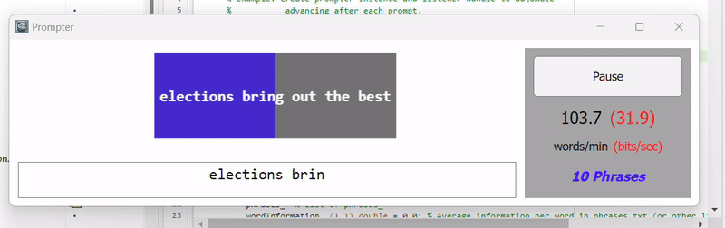

# MATLAB Typewriter Package #
Contains a simple app for providing text prompts based on the Mackenzie & Soukoreff 2003 dataset. Quick start:  

```batch
git submodule add git@github.com:Neuro-Mechatronics-Interfaces/matlab_package__typewriter.git +typewriter
git submodule update --init --recursive
```

## Overview
The **Prompter Typing Interface** is a MATLAB-based application designed for guided typing tasks. It provides real-time feedback for user input accuracy, tracks words-per-minute (WPM) performance, and supports automated prompt advancement.

The interface is implemented as a MATLAB class (`Prompter`) and includes a graphical user interface (GUI) built with `uifigure`. It is especially suited for typing-based experiments, training applications, or research studies.

## Features
- **Real-Time Typing Feedback**: 
  - Background colors dynamically update to indicate correct, incorrect, and incomplete text.
- **Words-Per-Minute Tracking**: 
  - Displays live WPM statistics based on typing speed.
- **Configurable Phrase Set**: 
  - Load custom typing prompts from a text file.
- **Auto-Advance Mode**: 
  - Automatically advances to the next prompt upon completion.
- **GUI Controls**:
  - Pause and resume functionality.
  - Integrated heads-up display (HUD) for WPM statistics.

## Interface
- **Main Typing Area**:
  - Displays the current prompt with background color feedback for each character.
  - Includes a text input box for user typing.
- **Right-Side HUD**:
  - Displays current WPM.
  - "Pause" button to stop typing and disable input temporarily.

## Installation
1. Clone or download the project to your local system.
2. Ensure MATLAB is installed (tested with MATLAB R2024a).
3. Place the project directory in your MATLAB path.

## Usage
If you have correctly installed the contents of this repository to a folder named `+typewriter` which is on your workspace path in the MATLAB editor, then you can test/observe how the UDP interface runs by running the following command:  
```matlab
typewriter.example_auto_prompter;
```  

This should launch a script which will automatically read the current prompt (via JSON-serialized UDP message exchange, read from the loaded prompts that by default are found in `+typewriter/@Prompter/config/phrases.txt`), looking similar to the gif shown above. The main loop has a pause delay of 0.1 seconds; you can reduce this time to see that it increases the words/minute and bits/second throughput, as expected.  
